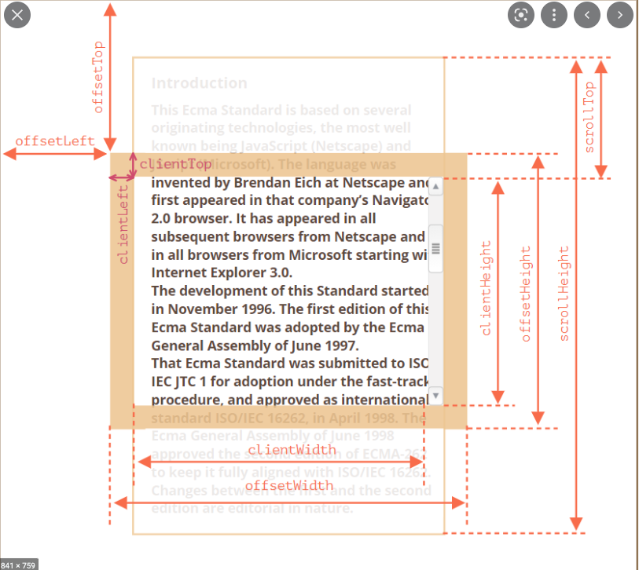

## 말풍선을 만들며 삽질한 요소 사이즈와 스크롤

- offsetTop, offsetLeft
    - 부모 요소의 Top, Left로 부터 얼마나 떨어져있는지의 값
- offsetHeight, offsetWidth
    - 요소의 높이, 너비 (패딩, 스크롤 바, 테두리 포함, 마진 제외)
- clientTop, clientLeft
    - 요소의 테두리 값
- clientHeight, clientWidth
    - 요소의 내부 높이, 너비 (패딩 값 포함, 스크롤바, 테두리, 마진 제외)
- scrollTop, scrollLeft
    - 요소 내 스크롤된 x, y 좌표값
- scrollHeight, scrollWidth
    - 요소에 들어있는 컨텐츠의 전체 높이 (패딩, 테두리 포함, 마진 제외)

### 근데 왜 Top, Left만 있을까?

- 화면 좌표계에 x축이 Left, y축이 Top이여서 그런거 아닐까? 라고 생각한다.